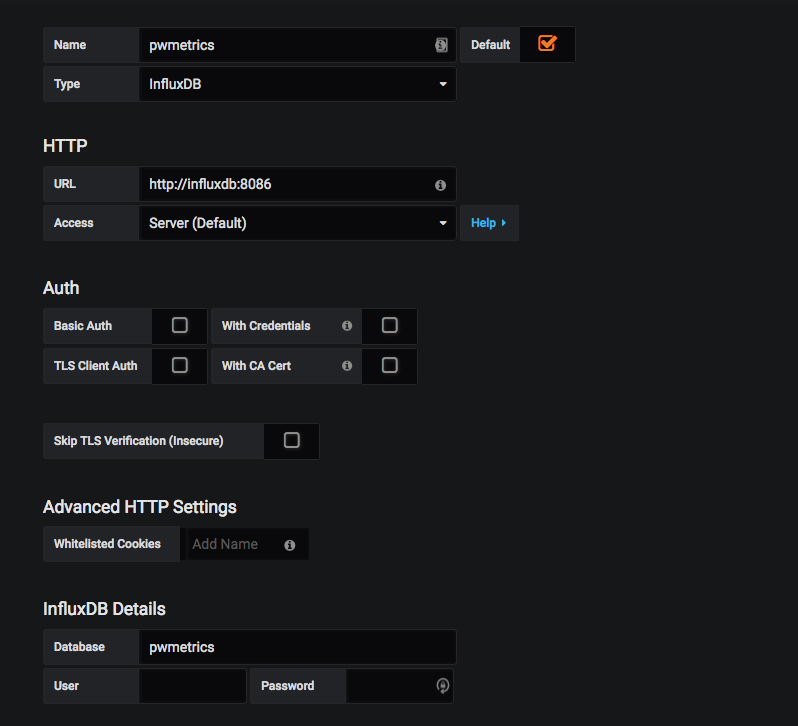

# Puppeteer-lighthouse

## Setup InfluxDB & Grafana

From root foder run 
```
docker-compose up
```
Create database 'pwmetrics' on induxDB using curl or api based on documentation (https://docs.influxdata.com/influxdb/v1.6/introduction/getting-started/)
 i.e. by POST request or 

 ```curl -X POST \
  http://localhost:8086/query?q=CREATE%20DATABASE%20pwmetrics
  ```

Grafana should be avaialable on localhost:3000
1. Login with admin:admin as username and password
2. Add data source with data as shown below


Import the [Dashboard template](dashboard.json) into Grafana.
On a different terminal when the docker compose file is running

Install modules and run test.

```
npm install
```

Then run
```
npm test
```
# Using Docker compose

docker-compose -f docker-compose.v4.yml up

# Using Docker compose with Kubernetes

docker build grafana/ -t $GRAFANA:latest

docker stack deploy --compose-file docker-compose.v3.yml lighthouse

kubectl proxy

http://localhost:8001/api/v1/namespaces/kube-system/services/https:kubernetes-dashboard:/proxy/#!/overview?namespace=default
